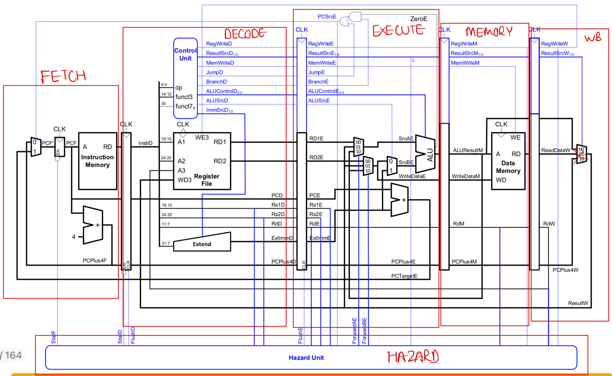
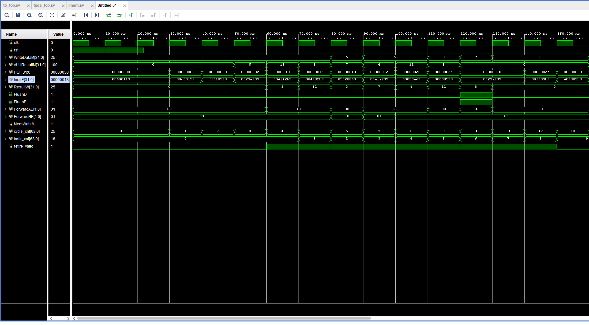
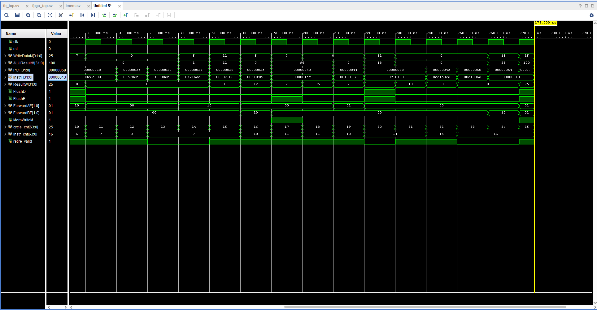
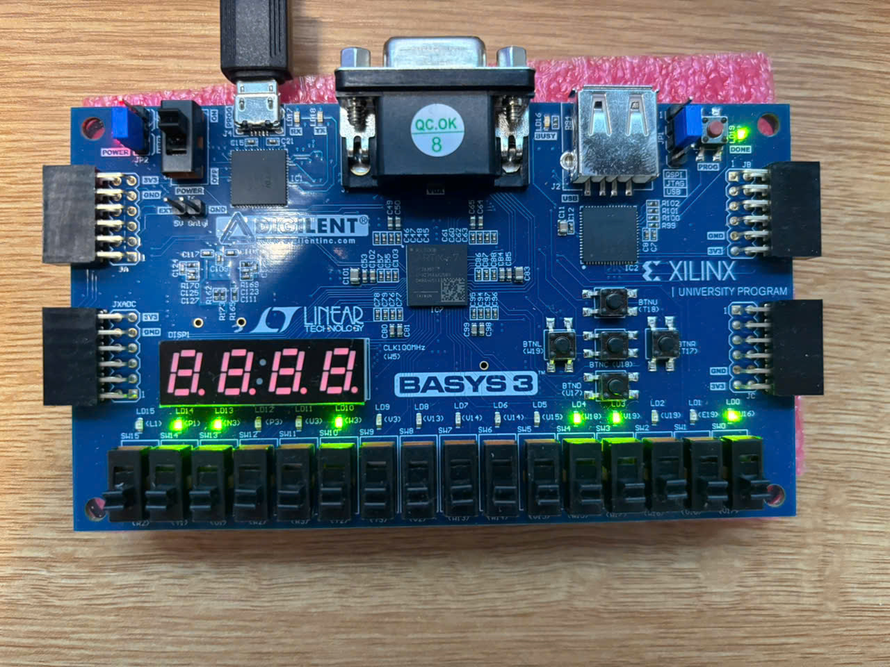

# RV32I 5-Stage Pipelined Core (Basys3)

> A clean RV32I 5-stage pipeline (**IF/ID/EX/MEM/WB**) with data forwarding, load-use stall, and branch/jump flush. Runs in sim and on the **Basys3** FPGA. Includes LED debug of stores.

 <!-- TODO: replace or remove -->

---

## Highlights
- **ISA:** RV32I subset (addi/andi/ori, add/sub/and/or/slt, beq, jal, lw, sw)
- **Pipeline:** IF → ID → EX → MEM → WB with **FlushD/FlushE**
- **Hazards:** 3-way forwarding, **load-use stall**, **branch/jump flush**
- **X-safety:** Pipeline regs reset to NOP; control bundles defaulted
- **FPGA:** Basys3 @ **50 MHz** timing met; **100 MHz** in progress
- **Debug:** LEDs show `{addr,data}` on store; `$display` under ``ifdef SIM``

---

## Table of Contents

- [Architecture](#architecture)
- [Repo Layout](#repo-layout)
- [Getting Started](#getting-started)
- [Simulation](#simulation)
- [FPGA (Basys3)](#fpga-basys3)
- [Verification](#verification)
- [Results](#results)
- [Design Notes](#design-notes)
- [Debug Diary](#debug-diary)
- [Roadmap](#roadmap)
- [Troubleshooting](#troubleshooting)
- [License](#license)
- [Credits](#credits)

---

## Architecture


<sub>**Adapted from:** David Money Harris & Sarah L. Harris, *Digital Design and Computer Architecture — RISC-V Edition*, ENG85RB course slides. © Harris & Harris. Annotations by this project; any mistakes are mine.</sub>

- **Structure:** 5 stages — IF/ID/EX/MEM/WB with IF/ID, ID/EX, EX/MEM, MEM/WB regs
- **Immediate/types:** I/S/B/J via `ImmSrc`, sign-extended in Decode
- **ALU ops:** add, sub, and, or, slt (+ immediate forms via alu_dec)
- **Forwarding:** Priority MEM > WB on both A/B paths (mux3 with selects `10/01/00`)
- **Stall/flush:** `lwStall` inserts bubble; `FlushD = PCSrcE`; `FlushE = PCSrcE | lwStall`
- **Instruction memory:** Combinational ROM (LUT-based) with optional `$readmemh` preload via `MEMFILE` parameter; defaults to a small hard-coded program for bring-up
- **Data memory:** **Synchronous, currently inferred as LUTRAM** (64 words) for small depth
- **Reset policy:** IF/ID seeded with NOP (`ADDI x0,x0,0`); all control lines zeroed
- **Design lineage:** The 5-stage pipeline partitioning (IF/ID/EX/MEM/WB), control/hazard approach (lw-use stall, branch/jump flush), and many signal names follow the presentation in *Digital Design and Computer Architecture, RISC-V Edition* (Harris & Harris). This repository reimplemented the design in SystemVerilog and adapted it for Basys3.

---

## Repo Layout

```text
rv32i-pipeline/
├─ README.md
├─ LICENSE                             
├─ docs/
│  └─ reflection.md                    # what to improve next
├─ rtl/
│  ├─ *.sv                             # core RTL (pkg, decode, execute, hazard, ...)
│  ├─ riscv_pkg.sv                     # RISC-V constants + decode/ALU enums + control/pipe bundle typedefs 
│  ├─ include
│  │  └─ config.svh                    # `define SIM` for sim-only prints
│  └─ fpga_top.sv                      # LEDs wrapper for Basys3
├─ scripts/
│  └─ build_fpga.tcl                   # Run FPGA  
├─ sim/
│  ├─ tb_top.sv                        # testbench
│  ├─ final.hex                        # program image
│  └─ *.sv                             # testbenches for modules                    
├─ fpga/basys3
│  ├─ top.xdc                          # pin constraints
│  └─ clk_wiz_0/clk_wiz_0.xci          # Clocking Wizard (100 MHz → 50 MHz)
 

```

---

## Getting Started
- **Tools:** Vivado 2022.1; Basys3 (XC7A35T)
- **Clone:** `git clone https://github.com/kainct/rv32i-pipeline && cd rv32i-pipeline`
- **Filesets (add to project):**
  - RTL: `rtl/*.sv`, `rtl/include/config.svh`, `rtl/fpga_top.sv`
  - Constraints: `fpga/basys3/top.xdc`
  - **IP:** `fpga/basys3/clk_wiz_0/clk_wiz_0.xci` (Clocking Wizard 100 MHz → 50 MHz)
- **Program image:** `sim/final.hex`
- **Defines:** in `config.svh`
  ```systemverilog
  `ifndef SYNTHESIS
    `define SIM
  `endif
    ```
- **Build (sim):** Vivado GUI → Flow Navigator → Simulation
- **Build (fpga):** Vivado GUI → Flow Navigator → Synthesis → Implementation → Bitstream → Program device
- **Build via Tcl:**
  Prereqs: Vivado **2022.1** (Basys3 board files installed).

  From repo root:
  ```bash
  # Creates ./riscv_pipelined project and adds sources/constraints/IP
  vivado -mode batch -source scripts/build_fpga.tcl -tclargs --origin_dir ./scripts
  ```

  From scripts/:
  ```bash
  vivado -mode batch -source build_fpga.tcl
  ```

---

## Simulation
- **Entry:** `sim/tb_top.sv` (instantiates `top`, clock/reset, connects IMEM/DMEM)
- **Clock/Reset:** `CLK_PERIOD = 20 ns` (50 MHz). Reset asserted ~22 ns then de-asserted.
- **Program load:** IMEM is a LUT-ROM with `$readmemh` via the `MEMFILE` parameter. If empty, a small hard-coded bring-up program runs.
- **Stop rule:** Testbench watches for a terminating store (e.g., `mem[0x00000064] = 32'd25`) → `$finish`; otherwise `$fatal("TIMEOUT")`.
- **Checks & Asserts:** x0 write-protect; no **X** after reset on `PCSrcE`, `FlushD`, `FlushE`, `MemWriteM`; control encoding sanity.
- **Debug:** `$display` traces for IF/ID/EX/MEM/WB and hazard unit under ``SIM``.
- **Waveforms:** VCD via `$dumpfile/$dumpvars` or XSim `.wcfg` focused on forwarding, stalls, and flushes.

---

## Test Program (Assembly ↔ Machine Code)

This is the program loaded into `sim/final.hex`. The PC shown in waveforms
(**PCF**) should match the **Address** column below as the
instruction flows IF→ID→EX→MEM→WB.

| Label  | RISC-V Assembly          | Description                     | Address | Machine Code |
|:------:|--------------------------|---------------------------------|:-------:|:------------:|
| main   | addi x2, x0, 5           | initialize x2 = 5               | 0x00    | 00500113     |
|        | addi x3, x0, 12          | initialize x3 = 12              | 0x04    | 00C00193     |
|        | addi x7, x3, -9          | initialize x7 = 3               | 0x08    | FF718393     |
|        | or   x4, x7, x2          | x4 = (3 OR 5) = 7               | 0x0C    | 0023E233     |
|        | and  x5, x3, x4          | x5 = (12 AND 7) = 4             | 0x10    | 0041F2B3     |
|        | add  x5, x5, x4          | x5 = 4 + 7 = 11                 | 0x14    | 004282B3     |
|        | beq  x5, x7, end         | not taken                       | 0x18    | 02728863     |
|        | slt  x4, x3, x4          | x4 = (12 < 7) = 0               | 0x1C    | 0041A233     |
|        | beq  x4, x0, around      | taken                           | 0x20    | 00020463     |
|        | addi x5, x0, 0           | shouldn't execute               | 0x24    | 00000293     |
| around | slt  x4, x7, x2          | x4 = (3 < 5) = 1                | 0x28    | 0023A233     |
|        | add  x7, x4, x5          | x7 = 1 + 11 = 12                | 0x2C    | 005203B3     |
|        | sub  x7, x7, x2          | x7 = 12 − 5 = 7                 | 0x30    | 402383B3     |
|        | sw   x7, 84(x3)          | mem[96] = 7                     | 0x34    | 0471AA23     |
|        | lw   x2, 96(x0)          | x2 = mem[96] = 7                | 0x38    | 06002103     |
|        | add  x9, x2, x5          | x9 = 7 + 11 = 18                | 0x3C    | 005104B3     |
|        | jal  x3, end             | jump; x3 = 0x44                 | 0x40    | 008001EF     |
|        | addi x2, x0, 1           | shouldn't execute               | 0x44    | 00100113     |
| end    | add  x2, x2, x9          | x2 = 7 + 18 = 25                | 0x48    | 00910133     |
|        | sw   x2, 0x20(x3)        | mem[100] = 25                   | 0x50    | 0221A023     |
| done   | beq  x2, x2, done        | infinite loop                   | 0x54    | 00210063     |

**Correlating waves to code**
- **IF stage:** `PCF` = Address, `InstrF` = Machine Code at that address.
- **Memory ops:** At store, watch `ALUResultM` (addr) and `WriteDataM` (data); LEDs mirror the low bytes on hardware.
- The terminating condition in `tb_top.sv` matches the `sw` to `mem[100] = 25`.

**Files**
- Hex image: `sim/final.hex`

## Waveform Snapshots

### 0 ns → 150 ns


- PCs: `0x00 → 0x04 → 0x08 → 0x0C → 0x10 → 0x14 → 0x18 → 0x1C → 0x20 → 0x24 → 0x28 → 0x2C → 0x30`
- Highlights:
  - Register inits: `addi x2=5`, `addi x3=12`, `addi x7=3`
  - Logic ops: `or x4=7`, `and x5=4`, `add x5=11`
  - **Branch @0x18 not taken**, **branch @0x20 taken** (`FlushD/FlushE` visible as IF/ID squash + EX bubble)
  - Forwarding engages on back-to-back ALU deps (`ForwardAE/BE` toggle; MEM>WB priority)

### 150 ns → end


- PCs: continue through `0x28, 0x2C, 0x30, 0x34, 0x38, 0x3C, 0x40, 0x48, 0x50, 0x54`
- Highlights:
  - `slt x4=1`, `add x7=12`, `sub x7=7`
  - Store/load window: `sw x7, 84(x3)` then `lw x2, 96(x0)` (watch `MemWriteM` pulse)
  - Final math: `add x2, x2, x9` → **25**
  - **End condition:** `sw x2, 0x20(x3)` writes **25** to `mem[100]`

> **Signals shown (recommended):** `PCF[31:0]`, `InstrF[31:0]`, `ALUResultM[31:0]`, `WriteDataM[31:0]`, `ResultW[31:0]`, `FlushD`, `FlushE`, `ForwardAE[1:0]`, `ForwardBE[1:0]`, `MemWriteM`, `retire_valid`, `cycle_cnt`, and `instr_cnt`.


---

## FPGA (Basys3)
- **Top wrapper:** `rtl/fpga_top.sv`  
  Ports: `CLK100MHZ` (W5), `rst_BTN` (U18), `LED[15:0]` (U16…L1).
- **Clocking:** `clk_wiz_0` generates **50 MHz** from the board 100 MHz.  
  *Tip:* In Vivado, **Generate Output Products** for the IP and add `fpga/basys3/clk_wiz_0/clk_wiz_0.xci` to the project (and repo).
- **LEDs:** `{LED[15:8], LED[7:0]} = {ALUResultM[7:0], WriteDataM[7:0]}`; `LED[15] |= MemWriteM` (blink on store).
- **IMEM:** LUT-ROM (async) for bring-up. For higher Fmax or bigger images, switch to **BRAM/XPM** (sync, 1-cycle latency).
- **DMEM:** **LUTRAM (64 words)** with **registered read**. To force BRAM later, increase depth and/or add `(* ram_style="block" *)`.
- **Timing @50 MHz:** Met comfortably (see Results).  
  **@100 MHz:** Work-in-progress; expect improvement with BRAM IMEM and minor path balancing.

---

## Basys3 Bring-Up
- **DONE** LED lit (bitstream loaded), **POWER** LED on.  
- Several user **LEDs (LD0...LD15)** active - this design maps LEDs to the write-back bus for quick visual debug:
  `  {LED[15:8], LED[7:0]} = {ALUResultM[7:0], WriteDataM[7:0]} `
- **CLK:** on-board **100MHz → clk_wiz → 50 MHz** core clock.
- **Reset:** `rst_BTN (BTN0)` used for synchronous reset.



> **Correctness check.** The design maps LEDs to `{ALUResultM[7:0], WriteDataM[7:0]}`.  
> In this run, the **final store** shows `ALUResultM = 0x64` (address **100**) and `WriteDataM = 0x19` (decimal **25**) — exactly what the test program expects (`mem[100] = 25`).
  ---
  
## Verification
- **Directed tests:** ALU/immediates, branches (taken/not), `lw/sw`, hazard paths (fwdA/B), load-use stall, branch/jump flush.
- **Assertions:** x0 write-protect; valid control encodings; `FlushD = PCSrcE`; `FlushE = PCSrcE | lwStall`.
- **Retirement:** Instruction “retires” at **WB** when `MEMWB_valid == 1`.
- **CPI:**  
  - **Raw:** `cycles / retired`  
  - **Startup-adjusted:** `(cycles − 4) / retired` (subtract 4-cycle pipe fill)
- **Pass/fail:** All directed tests pass; x0 always 0; no **X** after reset; terminating store observed and value matches.

---

## Results
- **ISA subset:** RV32I (addi, R-type, `beq`, `lw/sw`, `jal`)

**CPI**
- *Hazard-free microbench:* `cycles = 17`, `retired = 13` → **CPI_raw = 1.3077**, **CPI_adj = 1.0000** ✅
- *Mixed program:* `cycles = 25`, `retired = 16` → **CPI_raw = 1.5625**, **CPI_adj = 1.3125**

**Utilization (Basys3, post-synthesis)**
- **Slice LUTs:** **358** (≈ **278 logic + 80 LUTRAM**)
- **Slice Registers:** **261**
- **BRAM:** **0** (IMEM/DMEM are LUT-based at current sizes)
- **DSP:** **0**
- **IOBs:** **17**
- **Clocking:** `clk_wiz_0` present (shows **MMCM/BUFG** once IP output products are generated; otherwise reported as a black box)

**Timing**
- **@50 MHz (20 ns):** Met, **WNS = +11.458 ns** (critical path ≈ **8.542 ns**)
- **Max Fmax (≈ 1 / crit-path):** **~117 MHz**
- **@100 MHz:** WIP (close with BRAM IMEM + minor path cleanup)

---

## Design Notes
- **Forwarding priority:** MEM > WB on both A/B paths (mux3: `10 / 01 / 00`).
- **Load-use:** Single bubble; stores source RS2 via forwarded `RS2_fwd`.
- **Flush policy:** `FlushD = PCSrcE`; `FlushE = PCSrcE | lwStall`.
- **Reset:** IF/ID seeded with NOP (`ADDI x0,x0,0`); control bundles defaulted to safe values.

---

## Debug Diary (highlights)
- **Ghost instr after taken branch** → Missing IF/ID flush. **Fix**: pure combinational redirect; `FlushD = take_branch; FlushE = take_branch | lwStall;` and ID/EX inserts NOP. **Result**: no spurious WB.
- **Reg clobber after `addi`** → Mistimed flush let a stray instr advance; forwarding couldn’t hide it. **Fix**: corrected flush timing, enforce MEM > WB priority, add explicit `lwStall`. **Result**: one-cycle bubble then correct operands at EX.
---

## Future Extensions

### 1) Core completeness & ISA
- Implement more RV32I ops (BNE/BGE*/BLT*, shifts, LUI/AUIPC).

### 2) Privileged spec & traps
- **Machine mode** CSRs and **trap/exception** handler (illegal instr, misalign, ecall).
- **CLINT/mtime** for timer interrupts; simple **PLIC** for external IRQs.
- Proper **reset/boot ROM**, trap vector, and minimal runtime.

### 3) Memory system
- Move IMEM/DMEM to **BRAM** by default; scale depths.
- Add **I-cache/D-cache** (direct-mapped first; write-through + write buffer).
- AXI-Lite/Wishbone **memory-mapped I/O** window.

### 4) Bus & SoC integration
- Replace direct mem ports with a **clean bus** (AXI-Lite or Wishbone).
- On-FPGA peripherals: **UART**, **GPIO**, **SPI**, **I²C**, **timer**, **PWM**.

### 5) Front-end performance
- Deeper pipeline (6–7 stages) or **single-cycle BRAM fetch** with alignment unit.

### 6) Performance targets
- 50 MHz → **100+ MHz** on Basys3 with BRAM IMEM/DMEM.
- **CPI < 1.2** on mixed workloads with predictor + store buffer.
- Cacheable memory bandwidth and miss penalty characterization.

---


## Troubleshooting
- **Clock IP is “black box”:** Right-click `clk_wiz_0` → *Generate Output Products* → *Out-of-context per IP*. Ensure `fpga/basys3/clk_wiz_0/clk_wiz_0.xci` is added to the project & repo.
- **BRAM not inferred:** Use synchronous read, sufficient depth/width, optional `(* ram_style="block" *)`.
- **Program doesn’t run:** Check `$readmemh` path/format, IMEM depth, reset polarity; scan synth messages for RAM inference.
- **Xs after reset:** Seed IF/ID with NOP; initialize control bundles; avoid `===` in critical comb logic.

---

## License
MIT — see `LICENSE`.

---

## Credits
- **Author:** Kai Nguyen (kainct)  
- **Board:** Digilent Basys3 (XC7A35T)  
- **Spec:** RISC-V RV32I
- **Acknowledgments:** Harris & Harris, *Digital Design and Computer Architecture, RISC-V Edition*, for the pipeline organization and hazard/control reference.

---


